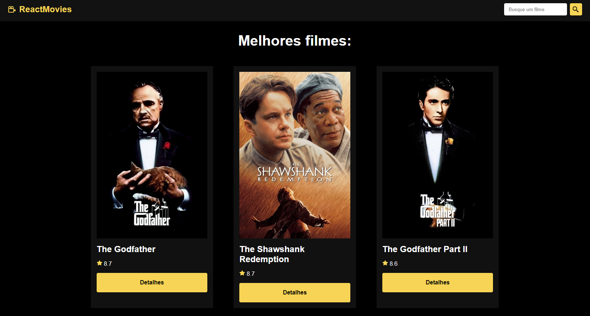

<h1 align="center">React Movies</h1>

O projeto foi desenvolvido durante o curso [React do zero a maestria](https://www.udemy.com/course/react-do-zero-a-maestria-c-hooks-router-api-projetos/) do [Matheus Battisti](https://www.youtube.com/@MatheusBattisti). O objetivo foi criar um site de filmes consumindo a API do TMDB.

### 🔗 Links

- URL do site no ar: [Clique aqui!](https://react-movies-ebon.vercel.app/)

### 🛠 Tecnologias

As seguintes ferramentas foram usadas na construção do projeto:

- React
- JavaScript
- HTML
- CSS
- Vite
- React router
- TMDB API

### Autor
---

Feito por Matheus Cardoso Morais 👋🏽 Entre em contato!

 

